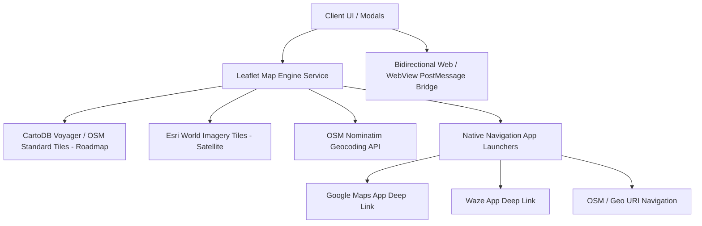

# Implementation Plan: Migrate Mapping Infrastructure to Leaflet & OpenStreetMap (OSM)

Transition SaltDistribute's mapping, location picking, routing visualization, and geospatial telemetry services from legacy Google Maps JavaScript API dependencies to a dedicated **Leaflet 1.9.4 + OpenStreetMap (OSM)** architecture.

---

## Architecture Overview

### Key Architectural Pillars:
1. **Zero API Key Dependency & Zero Cost**: Completely eliminate external billing dependencies (`DEMO_MAP_ID`, Google Maps Cloud Console billing locks, quota exhaustion).
2. **Unified Leaflet Map Builder (`src/services/leafletService.ts`)**: A modular HTML/JS generator for rendering interactive Leaflet maps with custom styled markers, route polylines, animated radar pulses, popups, and layer toggles.
3. **Cross-Platform Parity (Web iframe & Mobile WebView)**: Responsive touch support, drag-and-drop marker relocation, pinch-to-zoom, and synchronized position messaging.
4. **Resilient Geocoding & Routing**: Built on OpenStreetMap Nominatim reverse geocoding (`reverseGeocode`) with caching and graceful offline fallbacks.

---

## User Review Required

> [!IMPORTANT]
> **Native Navigation Hand-off Retained**: While in-app interactive map rendering will run exclusively on Leaflet + OpenStreetMap, external action buttons (**"Open in Google Maps"** and **"Open in Waze"**) will continue to open official navigation apps on drivers' devices for real-time turn-by-turn voice directions.

---

## Proposed Changes

### 1. Geospatial & Leaflet Core Service Layer

#### [NEW] [leafletService.ts](file:///c:/Users/AL_AAF/Project/Orrder%20management%20spp/src/services/leafletService.ts)
- Create a dedicated generator for Leaflet map HTML templates:
  - `generateRouteMapHtml`: Origin + destination markers, route line, bounds fitting, layer switcher (Roadmap/Satellite).
  - `generateLocationPickerMapHtml`: Draggable pin, map click listener, real-time coordinate broadcasting via `postMessage`.
  - `generateLiveRadarMapHtml`: Live GPS telemetry markers, accuracy radius circle, animated pulse radar.
  - `generateCustomerLocationMapHtml`: Customer site preview with custom badges.
- Tile provider presets (CartoDB Voyager, OpenStreetMap Standard, Esri Satellite).

#### [MODIFY] [mapsService.ts](file:///c:/Users/AL_AAF/Project/Orrder%20management%20spp/src/services/mapsService.ts)
- Update documentation and add OSM navigation links (`https://www.openstreetmap.org/directions?engine=fossgis_osrm_car&route=...`).
- Export unified layer types and route presets.

#### [MODIFY] [locationService.ts](file:///c:/Users/AL_AAF/Project/Orrder%20management%20spp/src/services/locationService.ts)
- Optimize Nominatim OpenStreetMap reverse geocoding with in-memory caching to minimize repeat network requests.

---

### 2. Map Modal Components & UI Migration

#### [MODIFY] [GoogleDeliveryMapModal.tsx](file:///c:/Users/AL_AAF/Project/Orrder%20management%20spp/src/components/GoogleDeliveryMapModal.tsx) (and export alias `DeliveryMapModal.tsx`)
- Migrate to use `generateRouteMapHtml` from `leafletService.ts`.
- Update branding and badges to **"PETA RUTE LOGISTIK (OSM)"**.

#### [MODIFY] [GoogleLocationPickerModal.tsx](file:///c:/Users/AL_AAF/Project/Orrder%20management%20spp/src/components/GoogleLocationPickerModal.tsx) (and export alias `LocationPickerModal.tsx`)
- Migrate to `generateLocationPickerMapHtml` with drag/drop pin relocation and immediate coordinate sync.

#### [MODIFY] [CustomerLocationModal.tsx](file:///c:/Users/AL_AAF/Project/Orrder%20management%20spp/src/components/CustomerLocationModal.tsx)
- Connect to `leafletService.ts` for consistent styling, popup badges, and fast loading.

#### [MODIFY] [AdminLiveRadarModal.tsx](file:///c:/Users/AL_AAF/Project/Orrder%20management%20spp/src/components/AdminLiveRadarModal.tsx)
- Migrate to `generateLiveRadarMapHtml` with animated radar sweep and GPS telemetry accuracy circle.

---

### 3. Screen Integration & Localization

#### [MODIFY] [index.tsx (buyer)](file:///c:/Users/AL_AAF/Project/Orrder%20management%20spp/app/(buyer)/index.tsx)
- Standardize map modal triggers and labels to use the Leaflet/OSM flow.

#### [MODIFY] [profile.tsx (buyer)](file:///c:/Users/AL_AAF/Project/Orrder%20management%20spp/app/(buyer)/profile.tsx) & [register.tsx (auth)](file:///c:/Users/AL_AAF/Project/Orrder%20management%20spp/app/(auth)/register.tsx)
- Ensure location picker modal seamlessly passes coordinates and resolved street names back to user forms.

#### [MODIFY] [index.tsx (i18n)](file:///c:/Users/AL_AAF/Project/Orrder%20management%20spp/src/i18n/index.tsx)
- Update text strings from "Google Maps" to platform-agnostic / OSM naming (e.g., "Pilih Titik Lokasi Peta", "Buka Navigasi Rute").

---

## Verification Plan

### Automated Verification
- Run TypeScript static type checking: `npx tsc --noEmit`
- Run linter verification: `npm run lint`

### Manual Verification
1. **Interactive Route Preview**: Open order booking flow & click route map -> Verify Leaflet loads instantly with Roadmap (CartoDB/OSM) & Satellite (Esri) layer toggle.
2. **Location Picker Pin Drop**: Open location picker -> Tap on map and drag pin -> Verify latitude, longitude, and address update in real time.
3. **Admin Live Radar**: Open Admin Live Radar -> Verify seller hub pin, buyer position, accuracy circle, and distance badge render smoothly.
4. **External Navigation Deep Links**: Click "Open in Google Maps" and "Open in Waze" -> Verify correct coordinates are passed into URLs.
